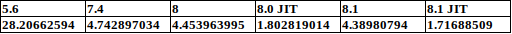
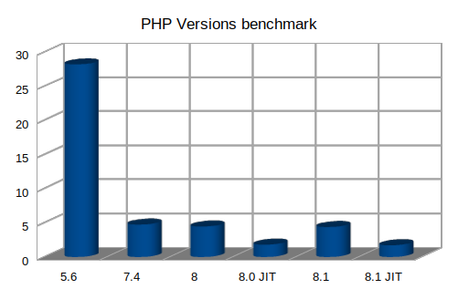

# PHP Benchmark
This repository is created for the purpose of having a performance benchmark on different versions of php

***
In order to use this you need docker and make use of different docker-compose files which run on different ports and 
check the execution time of the script which is using a bubble sort algorithm on an array of 10000 random generated numbers.
 
 ***
 I got the following times on a machine with 16Gb of RAM, Intel Core I7 CPU 5gen - 2.6Ghz and 250Gb SSD Hard Drive:

 
